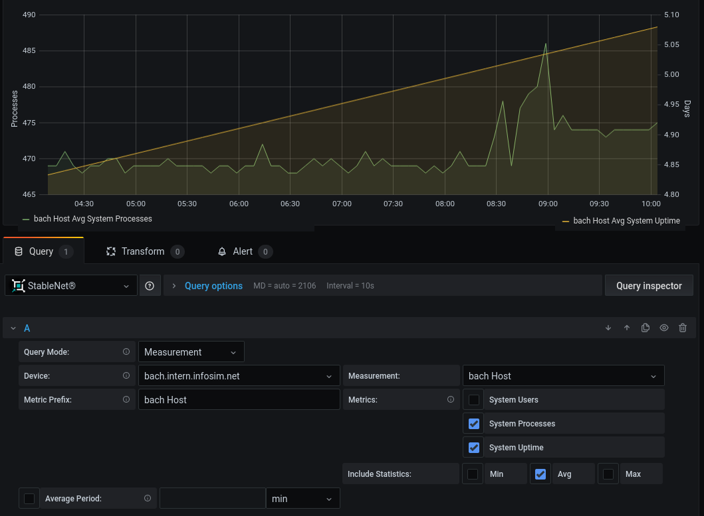

# StableNet® Data Source for Grafana®

StableNet® is the leading solution for Automated Network and Service Management. It is developed by Infosim®, an international and innovative Software & IT solution-provider.
The solution is vendor-independent, built entirely upon a single data structure and comprised of Four Key Pillars, namely: Discovery & Inventory, Network Configuration & Change, Fault Management & Root Cause Analysis, Performance & Service.
Find out more about StableNet® on the [website](https://www.infosim.net/stablenet/).

This plugin allows displaying and analyzing StableNet® measurement data within Grafana®.

Features of the Plugin
---

* Support for all measurement types and their metrics
* A choice to display min, max and average metrics
* A comprehensive UI for selecting the measurements and metrics
* An interactive search field for measurements and devices
* A Statistic Link mode: Directly paste StableNet® Analyzer links into Grafana (currently, this works only for 
  template measurements)



## Plugin Documentation and Installation

In order to use this plugin, you can simply issue the following command on your Grafana® Server:

```shell
grafana-cli --pluginUrl https://cloud.infosim.net/s/mPb5TF6pfHWScYW/download plugins install stablenet-grafana-plugin
```

After the installation, the datasource will be available in the Grafana® data sources list. A detailed documentation
of the plugin, its usages and use cases can be found in the directory `data/plugins/stablenet-grafana-plugin` of
your Grafana ® installation. Alternatively, to download the zip file manually, extract it and find the documentation
file `ADM - Grafana Data Source.pdf` in it.

## Building the plugin

### Prerequisites

- Go 1.14 or newer has to be installed
- Yarn has to be installed
- Run `cd frontend-plugin && yarn install` once

### Building

Building the plugin is done via `make`. Alternatively, you can execute the goals defined in the `Makefile` manually.
Please refer to the `Makefile` to learn about the building process.

# Legal

The Grafana Word Mark and Grafana Logo are either registered trademarks/service marks or
trademarks/service marks of Coding Instinct AB, in the United States and other countries and are used
with Coding Instinct’s permission. Infosim ® is not affiliated with, endorsed or sponsored by Coding Instinct,
or the Grafana community.

